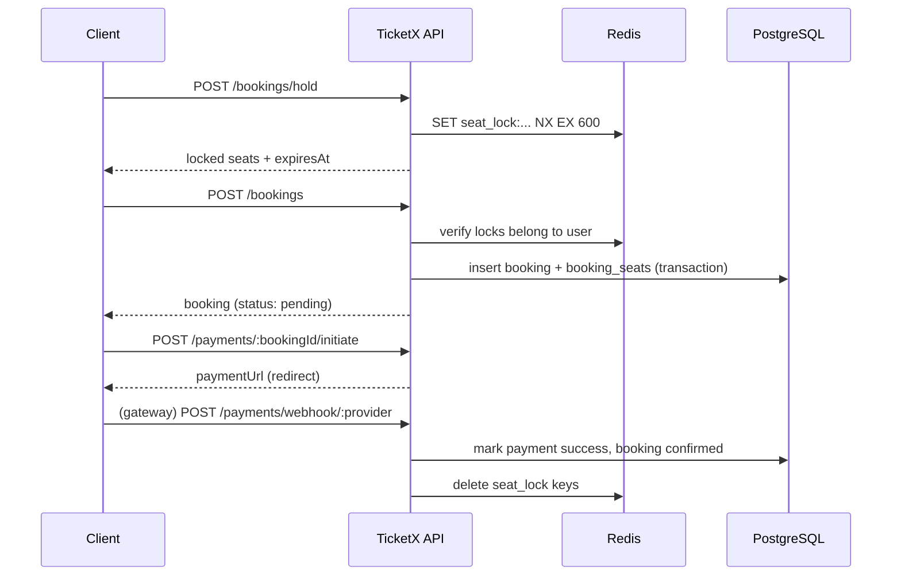

# TicketX – API_SPEC.md

> Companion docs: [`ARCHITECTURE.md`](./ARCHITECTURE.md) (request flow, layers) · [`DATABASE.md`](./DATABASE.md) (schema, feature ownership) · [`PROJECT-RULES.md`](./PROJECT-RULES.md) (DTO/validation patterns)

## 1. Overview
- **Base URL**: `https://api.ticketx.dev/api/v1` (local: `http://localhost:3000/api/v1`)
- **Versioning**: URI versioning (`/api/v1/...`), via Nest's `app.enableVersioning({ type: VersioningType.URI, defaultVersion: '1' })`. Breaking changes ship as `/api/v2/...` alongside `v1` until clients migrate.
- **Content-Type**: `application/json; charset=utf-8` for all requests/responses, except file uploads (`multipart/form-data`) and the payment webhook (raw body, provider-defined).

---

## 2. Authentication
- **Method**: JWT — short-lived access token + rotating refresh token. Enforced by `shared/guards/jwt-auth.guard.ts` (see `ARCHITECTURE.md` §2).
- **Header format**: `Authorization: Bearer <accessToken>`
- **Token flow**:
  | Token | TTL | Storage | Notes |
  |---|---|---|---|
  | Access | 15 min | client memory | payload: `{ sub, email, role, iat, exp }` |
  | Refresh | 7 days | httpOnly cookie or secure client storage | rotated on every use; old value is invalidated in Redis (`refresh_blocklist:{jti}`, TTL = remaining validity) |

  ```
  POST /auth/login    → { accessToken, refreshToken }
  POST /auth/refresh  → { accessToken, refreshToken }   (rotates both)
  POST /auth/logout   → revokes the current refresh token
  ```
- **Auth error handling**: `401` = no/invalid/expired token (`AUTH_002`, `AUTH_003`); `403` = valid token but role not permitted (`AUTH_004`). See §5 for the full code table.

---

## 3. Request Conventions
- **Pagination** (list endpoints): `?page=1&limit=20` — `limit` capped at 100, defaults to 20.
- **Sorting**: `?sortBy=startTime&sortOrder=asc` (`sortOrder` = `asc`\|`desc`, default `desc`).
- **Filtering**: feature-specific query params, e.g. `GET /movies?status=now_showing&genreId=...`, `GET /showtimes?movieId=...&cinemaId=...&date=2026-08-20`.
- **Request body**: JSON, `camelCase` keys (matches DTOs in `PROJECT-RULES.md` §4), e.g. `{ "showtimeId": "...", "seatIds": ["..."] }`.
- **File upload**: `multipart/form-data`, field name `file` (e.g. `POST /movies/:id/poster`). Handled by a shared multer interceptor that streams to object storage and returns `{ url }` — controllers never touch the raw file buffer beyond that interceptor.

---

## 4. Response Format

**Success**
```json
{
  "success": true,
  "data": { "id": "b1a2...", "status": "confirmed" },
  "meta": { "page": 1, "limit": 20, "total": 134, "totalPages": 7 }
}
```
`meta` is only present on paginated list endpoints; omitted otherwise.

**Error**
```json
{
  "success": false,
  "error": {
    "code": "BOOKING_002",
    "message": "Seat A5 is locked by another user",
    "details": null
  }
}
```
`details` carries field-level validation errors (array) when `code` is `VALIDATION_001`; `null` otherwise. Both shapes are produced globally by `TransformInterceptor` / `AllExceptionsFilter` — feature code never hand-builds the envelope (see `ARCHITECTURE.md` §8).

---

## 5. Error Codes
Format: `[FEATURE]_[NUMBER]`, e.g. `BOOKING_002`, `PAYMENT_001`. Each feature documents its **full** code list in its own `context.md`; this doc only lists codes referenced in §7's examples plus the cross-cutting ones.

**HTTP status usage**
| Status | Used for |
|---|---|
| 200 / 201 | Successful GET/PATCH / successful POST creating a resource |
| 204 | Successful DELETE |
| 400 | Validation error, malformed request |
| 401 | Missing / invalid / expired token |
| 403 | Authenticated but not permitted (role check) |
| 404 | Resource not found |
| 409 | Business-state conflict (seat taken, duplicate email, voucher exhausted) |
| 429 | Rate limit exceeded |
| 500 | Unexpected server error (message sanitized in production) |

**Common codes**
| Code | HTTP | Meaning |
|---|---|---|
| `VALIDATION_001` | 400 | DTO validation failed — see `error.details` |
| `AUTH_001` | 401 | Invalid email or password |
| `AUTH_002` | 401 | Access token expired |
| `AUTH_003` | 401 | Access token missing or malformed |
| `AUTH_004` | 403 | Role not permitted for this action |
| `SYSTEM_001` | 500 | Unexpected server error |

**Feature-notable codes** (used in §7 examples)
| Code | HTTP | Meaning |
|---|---|---|
| `BOOKING_001` | 404 | Seat not found |
| `BOOKING_002` | 409 | Seat is locked by another user |
| `BOOKING_003` | 409 | Booking has expired |
| `PAYMENT_001` | 502 | Payment gateway returned an error |
| `PAYMENT_002` | 400 | Webhook signature verification failed |
| `VOUCHER_001` | 409 | Voucher expired or usage limit reached |

---

## 6. Endpoints by Feature

### Auth & User (`features/user`)
| Method | Path | Description | Auth |
|---|---|---|---|
| POST | `/auth/register` | Register a new customer account | Public |
| POST | `/auth/login` | Login, returns access + refresh tokens | Public |
| POST | `/auth/refresh` | Exchange refresh token for a new pair | Public (refresh token) |
| POST | `/auth/logout` | Revoke the current refresh token | Bearer |
| GET | `/users/me` | Get current user profile | Bearer |
| PATCH | `/users/me` | Update profile | Bearer |
| PATCH | `/users/me/password` | Change password | Bearer |

### Movie (`features/movie`)
| Method | Path | Description | Auth |
|---|---|---|---|
| GET | `/movies` | List movies (filter: `status`, `genreId`) | Public |
| GET | `/movies/:id` | Movie detail | Public |
| GET | `/movies/:id/reviews` | List reviews for a movie | Public |
| POST | `/movies/:id/reviews` | Add a review | Bearer (customer) |
| POST | `/movies` | Create movie | Bearer (admin) |
| PATCH | `/movies/:id` | Update movie | Bearer (admin) |
| DELETE | `/movies/:id` | Remove movie | Bearer (admin) |
| POST | `/movies/:id/poster` | Upload poster image | Bearer (admin) |

### Cinema (`features/cinema`)
| Method | Path | Description | Auth |
|---|---|---|---|
| GET | `/cinemas` | List cinemas (filter: `city`) | Public |
| GET | `/cinemas/:id/rooms` | List rooms in a cinema | Public |
| GET | `/rooms/:id/seats` | Static seat layout of a room | Public |
| POST | `/cinemas` | Create cinema | Bearer (admin) |
| POST | `/cinemas/:id/rooms` | Create room | Bearer (admin) |
| POST | `/rooms/:id/seats` | Bulk-create seats for a room | Bearer (admin) |

### Showtime (`features/showtime`)
| Method | Path | Description | Auth |
|---|---|---|---|
| GET | `/showtimes` | List showtimes (filter: `movieId`, `cinemaId`, `date`) | Public |
| GET | `/showtimes/:id` | Showtime detail | Public |
| GET | `/showtimes/:id/seats` | Live seat availability (DB + Redis lock state merged) | Public |
| POST | `/showtimes` | Create showtime | Bearer (admin) |
| PATCH | `/showtimes/:id` | Update showtime | Bearer (admin) |
| DELETE | `/showtimes/:id` | Cancel showtime | Bearer (admin) |

### Booking (`features/booking`)
| Method | Path | Description | Auth |
|---|---|---|---|
| POST | `/bookings/hold` | Temporarily lock selected seats (Redis, TTL) | Bearer |
| POST | `/bookings` | Create a `pending` booking from held seats | Bearer |
| GET | `/bookings` | List current user's bookings | Bearer |
| GET | `/bookings/:id` | Booking detail | Bearer |
| POST | `/bookings/:id/cancel` | Cancel a booking | Bearer |
| GET | `/bookings/:id/ticket` | Get e-ticket (QR payload) | Bearer |
| POST | `/bookings/:id/checkin` | Check in a ticket by scanning its QR | Bearer (staff) |

### Payment (`features/payment`)
| Method | Path | Description | Auth |
|---|---|---|---|
| POST | `/payments/:bookingId/initiate` | Create a payment intent / redirect URL | Bearer |
| POST | `/payments/webhook/:provider` | Gateway callback (signature-verified) | Public |
| GET | `/payments/:bookingId` | Payment status for a booking | Bearer |

### Combo (`features/combo`)
| Method | Path | Description | Auth |
|---|---|---|---|
| GET | `/combos` | List active combos | Public |
| POST | `/combos` | Create combo | Bearer (admin) |
| PATCH | `/combos/:id` | Update combo | Bearer (admin) |

### Voucher (`features/voucher`)
| Method | Path | Description | Auth |
|---|---|---|---|
| POST | `/vouchers/validate` | Validate a code against an order amount | Bearer |
| GET | `/vouchers` | List vouchers | Bearer (admin) |
| POST | `/vouchers` | Create voucher | Bearer (admin) |

---

## 7. Endpoint Details (complex endpoints)

The booking + payment flow spans three calls; the sequence below shows how they fit together (full technical flow in `DATABASE.md` §3).



### `POST /bookings/hold`
Request:
```json
{ "showtimeId": "st_123", "seatIds": ["seat_A5", "seat_A6"] }
```
Response `200`:
```json
{
  "success": true,
  "data": {
    "lockedSeats": ["seat_A5", "seat_A6"],
    "expiresAt": "2026-08-13T10:15:00Z"
  }
}
```
Errors: `BOOKING_001` (seat not found, 404) · `BOOKING_002` (seat already locked, 409)

### `POST /bookings`
Request:
```json
{
  "showtimeId": "st_123",
  "seatIds": ["seat_A5", "seat_A6"],
  "comboItems": [{ "comboId": "combo_1", "quantity": 1 }],
  "voucherCode": "SUMMER10"
}
```
Response `201`:
```json
{
  "success": true,
  "data": {
    "id": "bk_789",
    "bookingCode": "TX-2026-000789",
    "status": "pending",
    "totalAmount": 245000,
    "expiresAt": "2026-08-13T10:20:00Z"
  }
}
```
Errors: `BOOKING_002` (lock expired / not owned by caller, 409) · `VOUCHER_001` (invalid/expired code, 409) · `VALIDATION_001` (400)

### `POST /payments/:bookingId/initiate`
Request:
```json
{ "provider": "vnpay" }
```
Response `200`:
```json
{
  "success": true,
  "data": { "provider": "vnpay", "paymentUrl": "https://sandbox.vnpayment.vn/...", "amount": 245000 }
}
```
Errors: `BOOKING_003` (booking expired, 409) · `PAYMENT_001` (gateway error, 502)

### `POST /payments/webhook/:provider`
- Public, but request is rejected unless the provider's signature header/query hash validates (`PAYMENT_002` on mismatch).
- **Response body does not follow the standard envelope** — each gateway expects its own ack format (e.g. VNPay expects `{ "RspCode": "00", "Message": "Confirm Success" }`). This is the one endpoint intentionally exempt from §4.
- On success: marks `payments.status = success`, `bookings.status = confirmed`, deletes the seat lock keys, emits a `booking.confirmed` domain event (see `ARCHITECTURE.md` §5).

---

## 8. WebSocket Events (Real-time Seat Map)
Not in the original template categories (no GraphQL/gRPC here) — TicketX's real-time need is the live seat map, so it gets a Socket.io gateway instead.

- **Location**: `features/booking/booking.gateway.ts` (owned by the booking feature, same as the Redis lock logic).
- **Namespace**: `/showtimes`
- **Connection**: client sends `{ token }` in the handshake `auth` payload; a WS-adapted `JwtAuthGuard` validates it.
- **Rooms**: client emits `join` with `{ showtimeId }` to join room `showtime:{id}`; `leave` to exit.

| Event (server → client) | Payload | When |
|---|---|---|
| `seat:locked` | `{ seatId, expiresAt }` | another client just held this seat |
| `seat:released` | `{ seatId }` | hold expired or was cancelled |
| `seat:booked` | `{ seatId }` | payment confirmed — permanent |

- Payloads never include the locking user's identity — only seat state.
- If TicketX later scales beyond one instance, add `@socket.io/redis-adapter` so events fan out across processes; not needed for the current single-instance monolith.
