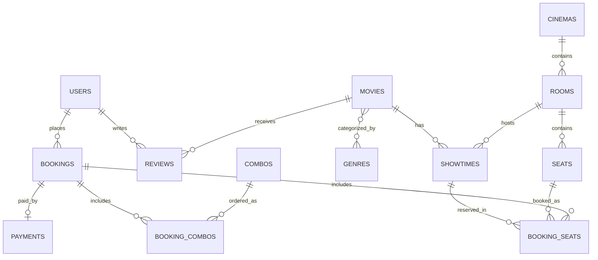

# TicketX – DATABASE.md

## Core Features
- **User**: `users`
- **Movie**: `movies`, `genres`, `movie_genres`, `reviews`
- **Cinema**: `cinemas`, `rooms`, `seats`
- **Showtime**: `showtimes`
- **Booking**: `bookings`, `booking_seats`
- **Payment**: `payments`
- **Combo**: `combos`, `booking_combos`
- **Voucher**: `vouchers`

---

## 1. Overview
- **Database**: PostgreSQL 15+ (source of truth) · Redis 7+ (seat locks, ephemeral cache)
- **ORM**: TypeORM — assumed, since decorator-based entities can live inside each `features/*` folder (fits feature-based org better than a single central schema file). Swap for Prisma if you prefer schema-first.
- **Naming conventions**:
  - Tables: `snake_case`, plural (`booking_seats`, not `bookingSeat`)
  - Columns: `snake_case` (`user_id`, `created_at`)
  - Indexes: `idx_<table>_<column(s)>` (e.g. `idx_showtimes_movie_id_start_time`)
  - Foreign keys: `fk_<table>_<referenced_table>`
  - Unique constraints: `uq_<table>_<column(s)>`

---

## 2. Entities by Feature

### Feature: User
**`users`**
| Field | Type | Constraint |
|---|---|---|
| id | uuid | PK |
| email | varchar | unique |
| password_hash | varchar | nullable (OAuth-only users) |
| full_name | varchar | not null |
| phone | varchar | nullable |
| role | enum(`customer`,`staff`,`admin`) | default `customer` |
| avatar_url | varchar | nullable |
| is_active | boolean | default true |

Indexes: `uq_users_email`

### Feature: Movie
**`movies`**
| Field | Type | Constraint |
|---|---|---|
| id | uuid | PK |
| title | varchar | not null |
| slug | varchar | unique |
| description | text | |
| duration_minutes | int | |
| release_date | date | |
| age_rating | enum(`P`,`C13`,`C16`,`C18`) | |
| poster_url | varchar | |
| trailer_url | varchar | nullable |
| status | enum(`coming_soon`,`now_showing`,`ended`) | |

Indexes: `uq_movies_slug`, `idx_movies_status`

**`genres`**: `id (uuid, PK)`, `name (varchar, unique)`
**`movie_genres`** (junction): `movie_id (FK)`, `genre_id (FK)` — composite PK, `ON DELETE CASCADE`

**`reviews`**
| Field | Type | Constraint |
|---|---|---|
| id | uuid | PK |
| movie_id | uuid | FK → movies |
| user_id | uuid | FK → users |
| rating | smallint | `CHECK (rating BETWEEN 1 AND 5)` |
| comment | text | nullable |

Indexes: `idx_reviews_movie_id`

### Feature: Cinema
**`cinemas`**: `id (uuid, PK)`, `name`, `address`, `city`, `phone`

**`rooms`**
| Field | Type | Constraint |
|---|---|---|
| id | uuid | PK |
| cinema_id | uuid | FK → cinemas |
| name | varchar | e.g. `"Room 1"` |
| room_type | enum(`standard`,`imax`,`4dx`) | |
| total_seats | int | denormalized |

**`seats`**
| Field | Type | Constraint |
|---|---|---|
| id | uuid | PK |
| room_id | uuid | FK → rooms |
| seat_row | varchar(2) | e.g. `"A"` |
| seat_number | int | e.g. `12` |
| seat_type | enum(`standard`,`vip`,`couple`) | |

Indexes: `uq_seats_room_id_seat_row_seat_number`

### Feature: Showtime
**`showtimes`**
| Field | Type | Constraint |
|---|---|---|
| id | uuid | PK |
| movie_id | uuid | FK → movies |
| room_id | uuid | FK → rooms |
| start_time | timestamptz | |
| end_time | timestamptz | |
| base_price | numeric(10,2) | |
| status | enum(`scheduled`,`ongoing`,`ended`,`cancelled`) | |

Indexes: `idx_showtimes_movie_id_start_time`, `idx_showtimes_room_id_start_time`

### Feature: Booking
**`bookings`**
| Field | Type | Constraint |
|---|---|---|
| id | uuid | PK |
| user_id | uuid | FK → users |
| showtime_id | uuid | FK → showtimes |
| booking_code | varchar | unique, encoded into QR |
| status | enum(`pending`,`confirmed`,`cancelled`,`expired`) | |
| voucher_code | varchar | nullable, snapshot |
| discount_amount | numeric(10,2) | default 0 |
| total_amount | numeric(10,2) | |
| expires_at | timestamptz | for pending auto-expiry |
| checked_in_at | timestamptz | nullable; set by `POST /bookings/:id/checkin` (staff) |

Indexes: `uq_bookings_booking_code`, `idx_bookings_user_id_created_at`

**`booking_seats`**
| Field | Type | Constraint |
|---|---|---|
| id | uuid | PK |
| booking_id | uuid | FK → bookings |
| showtime_id | uuid | denormalized, needed for unique index below |
| seat_id | uuid | FK → seats |
| price | numeric(10,2) | snapshot |
| status | enum(`pending`,`confirmed`,`cancelled`,`expired`) | mirrors the owning booking's status; denormalized so the partial index below can filter on it |

Indexes: `uq_booking_seats_showtime_id_seat_id` (partial, `WHERE status IN ('pending','confirmed')`) — DB-level double-booking guard, backs up the Redis lock (see §3).

### Feature: Payment
**`payments`**
| Field | Type | Constraint |
|---|---|---|
| id | uuid | PK |
| booking_id | uuid | FK → bookings |
| provider | enum(`vnpay`,`momo`,`stripe`) | |
| provider_transaction_id | varchar | for webhook reconciliation |
| amount | numeric(10,2) | |
| status | enum(`pending`,`success`,`failed`,`refunded`) | |
| paid_at | timestamptz | nullable |

Indexes: `idx_payments_booking_id`, `idx_payments_provider_transaction_id`

### Feature: Combo
**`combos`**: `id (uuid, PK)`, `name`, `description`, `price (numeric(10,2))`, `image_url`, `is_active (boolean)`
**`booking_combos`**: `id (uuid, PK)`, `booking_id (FK)`, `combo_id (FK)`, `quantity (int)`, `price (numeric(10,2), snapshot)`

### Feature: Voucher
**`vouchers`**
| Field | Type | Constraint |
|---|---|---|
| id | uuid | PK |
| code | varchar | unique |
| discount_type | enum(`percent`,`fixed`) | |
| discount_value | numeric(10,2) | |
| max_discount | numeric(10,2) | nullable, caps percent discounts |
| min_order_amount | numeric(10,2) | default 0 |
| valid_from / valid_to | timestamptz | |
| usage_limit | int | nullable = unlimited |
| used_count | int | default 0 |

Indexes: `uq_vouchers_code`

### Shared entities
None at this stage — every table has a single owning feature. If cross-cutting data emerges later (e.g. an audit log), it goes in `shared/entities`, not inside a feature folder.

---

## 3. Relationships

**Relationship conventions**
- FKs default to `ON DELETE RESTRICT`, except pure junction tables (`movie_genres`, `booking_combos`) which use `ON DELETE CASCADE`.
- Denormalize a field (e.g. `booking_seats.showtime_id`) only when it enables an index/constraint that can't be expressed through a join — comment the reason at the column.

**Cross-feature relationships** (FK crosses a feature boundary)
| From | To | Rule |
|---|---|---|
| `bookings.user_id` | `features/user` | read via `UserService`, never raw join |
| `bookings.showtime_id` | `features/showtime` | read via `ShowtimeService` |
| `booking_seats.seat_id` | `features/cinema` | read via `SeatService` |
| `reviews.movie_id` | `features/movie` | owned by movie feature; read-only from elsewhere |

Rule of thumb: a feature may hold an FK column to another feature's table, but must never query/join that table directly — go through the owning feature's exported service.

---

## 4. Conventions
- **Primary keys**: UUID v4 (Postgres `gen_random_uuid()` via `pgcrypto`, or app-generated). Avoids sequential-ID leakage and simplifies syncing across environments.
- **Soft delete**: not used by default — hard delete + `RESTRICT` FKs. Entities needing "hide, don't remove" use an explicit flag (`is_active` on `users`, `combos`) rather than a generic `deleted_at`.
- **Timestamps**: every table has `created_at`, `updated_at` (`timestamptz`, default `now()`); `updated_at` auto-managed by TypeORM's `@UpdateDateColumn()`.
- **Enum/Status handling**:
  - Stable, rarely-changing sets → native Postgres `enum` type (`role`, `seat_type`, `age_rating`).
  - Fast-evolving status fields → `varchar` + `CHECK` constraint (`bookings.status`, `payments.status`) to avoid `ALTER TYPE` migration pain when a new status is added.

---

## 5. Migration Rules
- **Naming format**: `{timestamp}-{PascalCaseDescription}.ts`, e.g. `1699999999999-CreateBookingSeatsTable.ts`.
- **Versioning**: one migration per logical schema change; never edit a migration that has run in a shared environment — write a new one instead.
- **Rollback policy**: every migration implements a full `down()`; test the rollback locally before merging. In shared/prod environments, prefer a new forward-fix migration over running `revert`.

---

## 6. TypeORM-Specific Patterns
- Entities live inside their owning feature: `features/booking/entities/booking.entity.ts`, `features/booking/entities/booking-seat.entity.ts`.
- Redis access is wrapped in a dedicated `SeatLockService` inside `features/booking` — no raw `ioredis` calls scattered across the codebase.
- Declare indexes with `@Index()` / `@Unique()` decorators on the entity, then run `typeorm migration:generate` — don't hand-edit generated SQL unless necessary.
- `synchronize: false` in every environment; schema changes only ever go through committed migrations.
