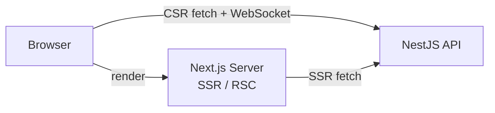
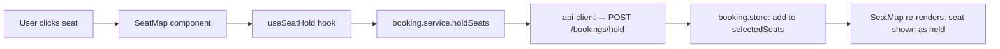

# TicketX – ARCHITECTURE.md (Frontend)

> Companion docs: [`API_SPEC.md`](./API_SPEC.md) (endpoints, envelope, auth) · [`PROJECT-RULES.md`](./PROJECT-RULES.md) (naming, patterns, anti-patterns) · backend `ARCHITECTURE.md` (mirrors this structure)

## 1. Overview

**Feature-based, not layer-based**: a frontend feature owns its components, hooks, services and store together — the same vertical slice as its backend counterpart (`features/booking` on both sides talk to the same table/endpoint set). A booking-flow change touches one folder, not a `components/`, `hooks/`, `services/` scattered across the app.

**Tech stack justification**:
| Choice | Why |
|---|---|
| Next.js (App Router) | SSR/RSC for read-heavy public pages (movie list, showtimes) → better SEO + first paint; file-system routing needs no separate router config |
| TanStack Query | Caches/dedupes calls to the `{success,data}` envelope from `API_SPEC.md`; built-in refetch/invalidation fits the seat-lock TTL model |
| Zustand | A handful of genuinely global states (auth, in-progress seat selection) — Redux's boilerplate isn't worth it for a solo project |
| Tailwind CSS | Fast iteration solo, no separate stylesheets to keep in sync with markup |
| Axios | Interceptors cleanly handle JWT attach + refresh-on-401, harder to do tersely with raw `fetch` |



---

## 2. Folder Structure
```
src/
├── app/                         # Next.js App Router — file-system routes
│   ├── layout.tsx                # root layout, wraps <Providers>
│   ├── providers.tsx             # QueryClientProvider, etc. (client component)
│   ├── (public)/
│   │   ├── page.tsx               # home
│   │   ├── movies/page.tsx
│   │   └── movies/[slug]/page.tsx
│   ├── (auth)/
│   │   ├── login/page.tsx
│   │   └── register/page.tsx
│   ├── (customer)/               # protected — requires session
│   │   ├── booking/[showtimeId]/page.tsx
│   │   ├── checkout/[bookingId]/page.tsx
│   │   └── my-bookings/page.tsx
│   └── (admin)/                  # protected — requires role=admin
│       ├── layout.tsx             # admin shell
│       └── movies/page.tsx
├── shared/
│   ├── components/                # Button, Modal, Input, Skeleton...
│   ├── hooks/                     # useDebounce, useMediaQuery...
│   ├── services/api-client.ts     # Axios instance: JWT attach, 401 refresh, envelope unwrap
│   ├── stores/auth.store.ts       # Zustand — current user, access token (in memory)
│   ├── types/api-response.type.ts
│   ├── events/event-bus.ts
│   └── utils/routes.ts            # named path constants, avoids magic strings
├── features/
│   ├── user/ movie/ cinema/ showtime/
│   └── booking/ payment/ combo/ voucher/
├── assets/                        # bundler-processed images/icons/fonts
└── styles/globals.css             # Tailwind directives + design tokens
```
> Static, unprocessed files (favicon, robots.txt) stay in the top-level `public/`, separate from `src/assets/`.

---

## 3. Feature Anatomy
```
features/booking/
├── components/    # SeatMap.tsx, BookingSummary.tsx
├── hooks/         # useSeatHold.ts, useCreateBooking.ts
├── services/      # booking.service.ts — wraps api-client
├── stores/        # booking.store.ts — selected seats, hold countdown
├── types/
├── utils/
├── pages/         # BookingPage.tsx — page-level composition
├── index.ts       # public barrel (only import path for other code)
└── context.md
```
`app/.../page.tsx` stays a thin route file — it renders `<BookingPage />` from `features/booking/pages`, nothing else. This keeps `app/` purely about routing while the feature owns the actual screen.

---

## 4. Data Flow

```
User Action → Component → Hook → Service → API
                              ↓
                       Store (if needed)
                              ↓
                          UI Update
```

Concrete example — selecting a seat:


| Layer | Responsible for |
|---|---|
| Component | Render + user input, calls a hook — no fetch, no business rules |
| Hook | Orchestrates: calls service (via TanStack Query), updates the store if the result is cross-component state |
| Service | One function per `API_SPEC.md` endpoint; talks only to `api-client` |
| Store | Holds the result only when 2+ components need it — otherwise the hook's local state is enough |

---

## 5. Cross-feature Communication
| Method | Use case | TicketX example |
|---|---|---|
| Global store | Auth, app-wide settings | `useAuthStore` read by every feature's guards |
| URL / Router | Navigation with params | `showtime` feature links to `/booking/[showtimeId]`; booking reads it via `useParams()` |
| Event emitter | Decoupled actions (rare) | `booking:confirmed` emitted by booking, consumed by showtime to invalidate its seat query |

No feature ever imports another feature's internals directly — see `PROJECT-RULES.md` §3.

---

## 6. Routing Structure
- **Public**: `/`, `/movies`, `/movies/[slug]`, `/login`, `/register`
- **Protected (customer)**: `/booking/[showtimeId]`, `/checkout/[bookingId]`, `/my-bookings` — gated by `middleware.ts`, which reads the httpOnly refresh-token cookie and redirects to `/login` if missing/invalid.
- **Protected (admin/staff)**: `(admin)/*`, `/staff/checkin` — same middleware also decodes the cookie's `role` claim; mismatched role redirects home instead of `/login`.
- **Route config per feature**: no central route registry — each feature documents its own path(s) in its `context.md`; shared path *constants* (not config) live in `shared/utils/routes.ts` so `<Link>` calls avoid magic strings.
- **Lazy loading**: route segments are code-split automatically by Next.js. Heavy, non-route-tied client components (e.g. a QR scanner in staff check-in) use `next/dynamic(() => import(...), { ssr: false })`.

---

## 7. State Management Strategy
| State Type | Location | Example |
|---|---|---|
| Server state | TanStack Query | movie list, showtime seat availability |
| Global UI | Zustand (`shared/stores`) | theme, locale |
| Auth | Zustand (`shared/stores/auth.store.ts`), access token in memory only, refresh token in httpOnly cookie | current user, roles |
| Feature state | Feature-scoped Zustand store | `booking.store.ts` — selected seats, hold countdown |
| Local UI | `useState`/`useReducer` in component | modal open/close, input focus |

---

## 8. API Layer
```
shared/services/api-client.ts   (Axios instance: base URL, JWT header, 401 → refresh → retry, envelope unwrap)
        ↓
features/[x]/services            (one function per API_SPEC.md endpoint, e.g. holdSeats())
        ↓
features/[x]/hooks               (TanStack Query useQuery/useMutation wrapping the service call)
        ↓
features/[x]/components           (consume the hook, render — never call the service directly)
```
`api-client.ts` is the **only** place Axios is imported outside tests — enforced by the anti-pattern rule in `PROJECT-RULES.md` §6.

---

## 9. Shared vs Features
| | `shared/` | `features/*` |
|---|---|---|
| Contains | Generic, reusable, no domain knowledge | Domain-specific UI + logic |
| Components | `Button`, `Modal`, `Skeleton` | `SeatMap`, `BookingSummary` |
| Services | `api-client.ts` (transport only) | `booking.service.ts` (domain endpoints) |
| Hooks | `useDebounce`, `useMediaQuery` | `useSeatHold`, `useCreateBooking` |
| Utils | `formatCurrency`, `routes.ts` | `booking.utils.ts` (e.g. seat-map layout math) |

Rule of thumb: if it would make sense in a different project with no ticketing domain at all → `shared/`. If it encodes a TicketX business rule → the owning feature.

---

## 10. Next.js-Specific Patterns
- **Server vs Client Components**: default Server; `'use client'` only where hooks/interactivity/WebSocket are needed (`SeatMap`, forms). Server Components fetch directly via the feature's service — no client-side waterfall on first load.
- **SSR / ISR / CSR split**: `/movies`, `/movies/[slug]` — ISR (`revalidate: 60`) since content changes infrequently; `/booking/[showtimeId]` — dynamic render + client fetch, since seat state must be live; `checkout`/`my-bookings` — fully client-interactive, no static generation.
- **Middleware**: `middleware.ts` at the repo root is the single place route-protection logic lives — features never re-implement auth redirects.
- **Zustand persistence**: only `authStore`'s non-sensitive fields (e.g. `userId`, `role` for UI) may use the `persist` middleware; the access token is never persisted, matching the "client memory" storage rule in `API_SPEC.md` §2.
