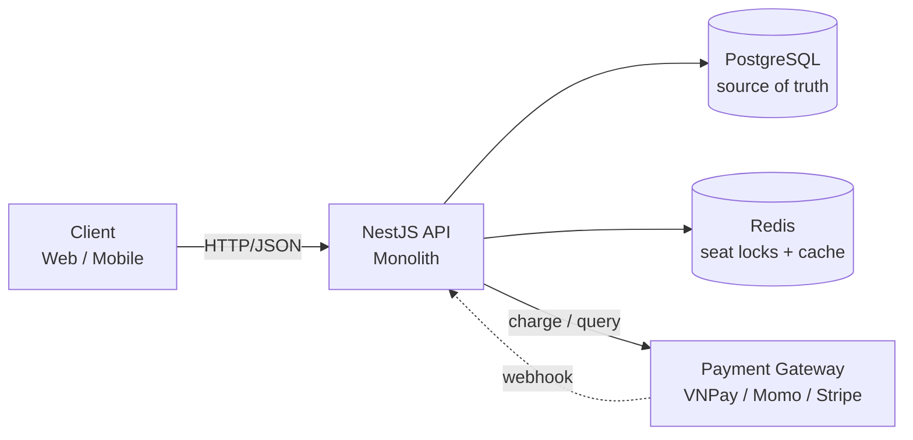
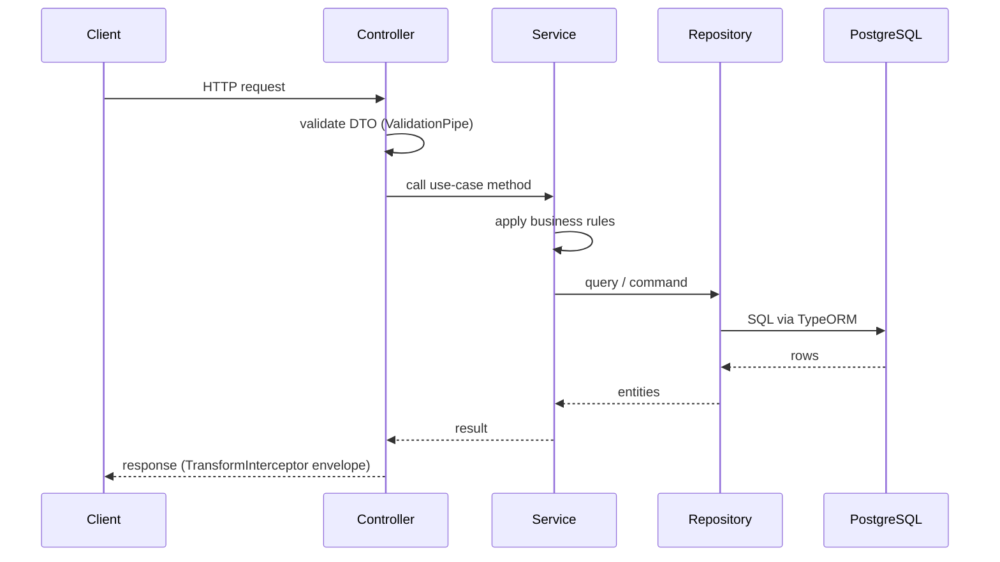

# TicketX – ARCHITECTURE.md (Backend)

> Companion docs: [`DATABASE.md`](./DATABASE.md) (schema, per-feature table ownership) · [`PROJECT-RULES.md`](./PROJECT-RULES.md) (naming, code patterns, anti-patterns)

## 1. System Overview



**Why feature-based, not layer-based:**
- One deployable monolith, but internally partitioned by business capability (`booking`, `payment`, `movie`...) instead of by technical layer (`controllers/`, `services/`, `repositories/`).
- A change to booking logic touches one folder, not four scattered ones — easier to reason about solo, and easier for an AI assistant to load just the relevant context.
- Each feature's boundary is already clean, so extracting a feature (e.g. `payment`) into its own service later is a folder move, not a rewrite.
- Matches table ownership in `DATABASE.md` 1:1 — every feature owns its tables and no others.

---

## 2. Folder Structure
```
src/
├── main.ts                    # bootstrap, global pipes/filters/interceptors
├── app.module.ts               # imports ConfigModule, CoreModule, all feature modules
├── config/
│   ├── configuration.ts        # typed config factory (app, db, redis, jwt, payment)
│   └── validation.schema.ts    # Joi schema — fail fast on invalid/missing env
├── core/                       # infrastructure the app cannot boot without
│   ├── database/
│   │   ├── database.module.ts  # TypeORM connection (global)
│   │   └── data-source.ts      # CLI data source, used by migrations
│   ├── cache/
│   │   └── redis.module.ts     # ioredis client provider (global)
│   └── logger/
│       └── logger.module.ts    # Nest Logger / Pino setup (global)
├── shared/                     # reusable, feature-agnostic, no infra state
│   ├── guards/
│   │   └── jwt-auth.guard.ts
│   ├── filters/
│   │   └── all-exceptions.filter.ts
│   ├── interceptors/
│   │   └── transform.interceptor.ts
│   ├── decorators/
│   │   └── current-user.decorator.ts
│   ├── middlewares/
│   │   └── request-logger.middleware.ts
│   ├── utils/
│   │   └── pagination.util.ts
│   └── types/
│       └── api-response.type.ts
└── features/
    ├── user/
    ├── movie/
    ├── cinema/
    ├── showtime/
    ├── booking/
    ├── payment/
    ├── combo/
    └── voucher/
```

---

## 3. Feature Anatomy
Every feature follows the same internal shape (full rationale in `PROJECT-RULES.md` §1):
```
features/booking/
├── booking.controller.ts   # HTTP layer
├── booking.service.ts      # business logic
├── booking.repository.ts   # data access (wraps TypeORM repo)
├── dto/
├── entities/                # maps 1:1 to tables owned in DATABASE.md
├── types/
├── booking.service.spec.ts  # colocated unit tests
├── booking.module.ts        # providers + explicit exports
└── context.md                # what this feature owns, key decisions
```

---

## 4. Request Flow

```
Request → Middleware/Guards → Controller → Service → Repository → Database
                                    ↓
                         Interceptor → Response
```



| Layer | Responsible for | Must NOT do |
|---|---|---|
| Controller | Routing, DTO validation, calling one service method, shaping the response | Contain business rules or direct DB access |
| Service | Business logic, orchestration, cross-feature calls | Build raw SQL/queries itself |
| Repository | All data access for its feature (TypeORM queries) | Contain business logic |

---

## 5. Cross-feature Communication
**Allowed:**
- Inject the other feature's **exported service** (constructor DI) — e.g. `BookingService` calls `ShowtimeService.getAvailableSeats()`.
- **Domain events** (`EventEmitter2`) for side effects that don't need a synchronous result — e.g. `booking.confirmed` triggers a notification feature, decoupled from the booking flow.

**Forbidden:**
- Importing another feature's repository, entity, or internal (non-exported) provider directly.
- Circular module dependencies between two features (extract a shared contract into `shared/` instead).

```ts
// Allowed — booking depends on showtime's exported service
constructor(private readonly showtimeService: ShowtimeService) {}

// Forbidden — bypasses the module boundary
import { ShowtimeRepository } from '../showtime/showtime.repository';
```

---

## 6. Shared vs Core

| | `shared/` | `core/` |
|---|---|---|
| Contains | Reusable, stateless building blocks | Infrastructure singletons the app boots with |
| Examples | Guards, filters, interceptors, decorators, generic utils, common types | Database connection, Redis client, logger config |
| Depends on env/secrets? | No | Yes (connection strings, credentials) |
| Imported by | Any feature, freely | `app.module.ts` (registered once, globally) |
| TicketX examples | `AllExceptionsFilter`, `TransformInterceptor`, `ApiResponse<T>` type | `DatabaseModule`, `RedisModule`, `LoggerModule` |

Rule of thumb: if it holds a connection/credential or the app can't start without it → `core/`. If it's a pure helper any feature could import → `shared/`.

---

## 7. Configuration Management
- **Environment variables**, grouped by domain: `APP_*` (port, env), `DATABASE_*`, `REDIS_*`, `JWT_*`, `PAYMENT_VNPAY_*` / `PAYMENT_MOMO_*` / `PAYMENT_STRIPE_*`.
- **Config files structure**:
  - `config/configuration.ts` — a factory function returning a nested, typed object (`{ app, database, redis, jwt, payment }`), consumed via `ConfigService.get('database.host')`.
  - `config/validation.schema.ts` — Joi schema passed to `ConfigModule.forRoot({ validationSchema })`; app **fails to boot** if a required var is missing/invalid, instead of failing at runtime.
- **Secrets handling**:
  - `.env` is git-ignored; `.env.example` (no real values) is committed as the reference.
  - Production secrets are injected via the hosting platform's env var store (Render/Railway/Fly), never committed or logged.
  - Logger redacts known secret keys (`password`, `token`, `secret`) if a payload is ever logged.

---

## 8. NestJS Modules, DI & Middleware Chain
- **`app.module.ts`** imports, in order: `ConfigModule.forRoot({ isGlobal: true, load: [configuration], validationSchema })` → `DatabaseModule` / `RedisModule` / `LoggerModule` (from `core/`, marked `@Global()`) → every `features/*.module.ts`.
- **Global providers**, registered once in `main.ts`:
  ```ts
  app.useGlobalPipes(new ValidationPipe({ whitelist: true, forbidNonWhitelisted: true }));
  app.useGlobalInterceptors(new TransformInterceptor());
  app.useGlobalFilters(new AllExceptionsFilter());
  ```
- **Execution order** per request: `Middleware` (e.g. request logger, helmet, cors) → `Guards` (auth) → `Interceptors` (pre-handler) → `Pipes` (DTO validation) → `Route Handler` → `Interceptors` (post-handler, shapes response) → `Exception Filters` (only if something threw).
- **Module encapsulation**: each feature module only `exports` its public service — see `PROJECT-RULES.md` §8 for the full rule set (repository pattern, Redis wrapping, DI-only construction).
